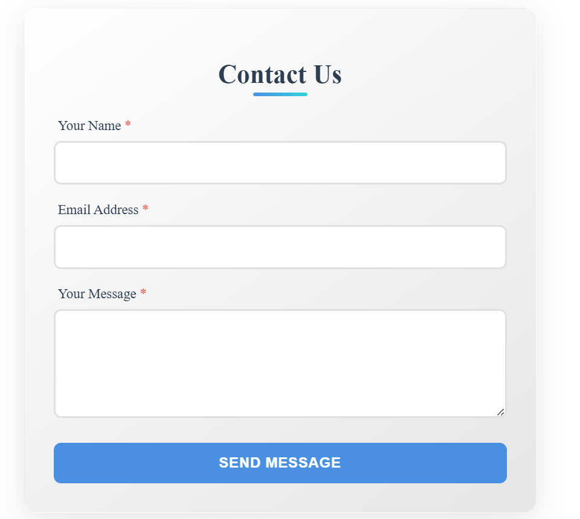
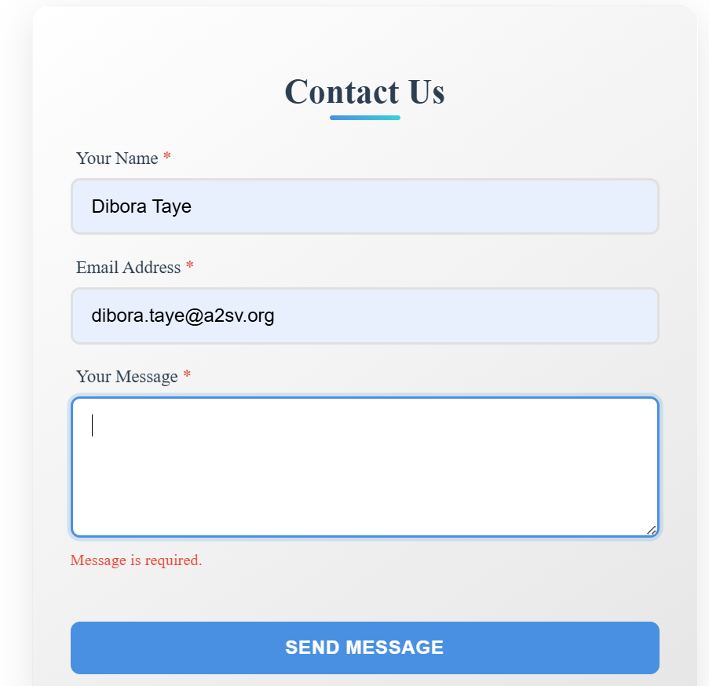
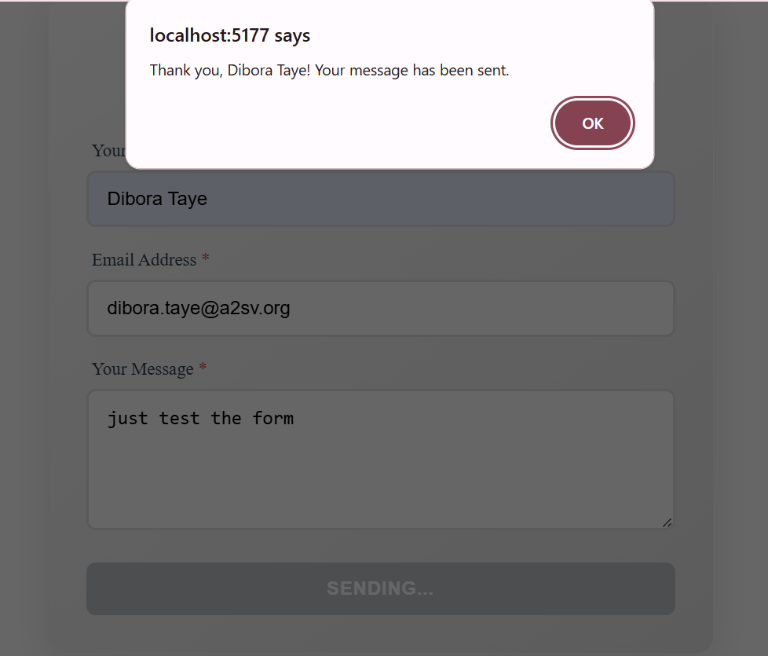

# Contact Form with React & TypeScript

A contact form built with React, TypeScript, and Vite. This form includes client-side validation, error handling, and a clean, user-friendly interface.

### Form


This is the main page where you can enter tasks.

### validate


Invalid when a user does not Ensert a Message

### Submit



## Form Fields

1. **Name** (required)

   - Must be at least 2 characters
   - Required field

2. **Email** (required)

   - Must be a valid email format
   - Required field

3. **Message** (required)
   - Must be between 10 and 500 characters
   - Required field

## Getting Started

### Prerequisites

- Node.js (v16 or later)
- npm (v7 or later) or yarn

### Installation

1. Clone the repository

   ```bash
   git clone https://github.com/Dibotaye/A2SV-web-track-tasks/tree/main/task_5
   cd task_5
   ```

2. Install dependencies

   ```bash
   npm install
   # or
   yarn
   ```

3. Start the development server

   ```bash
   npm run dev
   # or
   yarn dev
   ```

4. Open [http://localhost:5177](http://localhost:5177) in your browser

## Available Scripts

- `npm run dev` - Start development server
- `npm run build` - Build for production
- `npm run lint` - Run ESLint
- `npm run preview` - Preview production build

## Technologies Used

- [React](https://reactjs.org/)
- [TypeScript](https://www.typescriptlang.org/)
- [Vite](https://vitejs.dev/)
- [React Hook Form](https://react-hook-form.com/)

## Project Structure

```
src/
  ├── components/
  │   └── ContactForm.tsx  # Contact form component
  ├── App.tsx              # Main application component
  ├── main.tsx             # Application entry point

```
