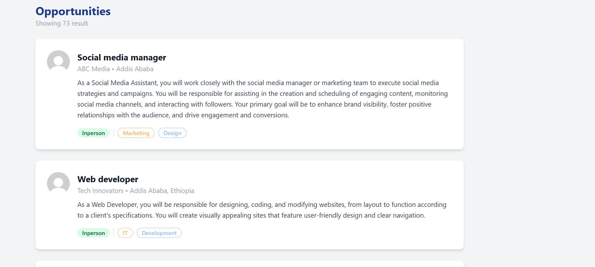
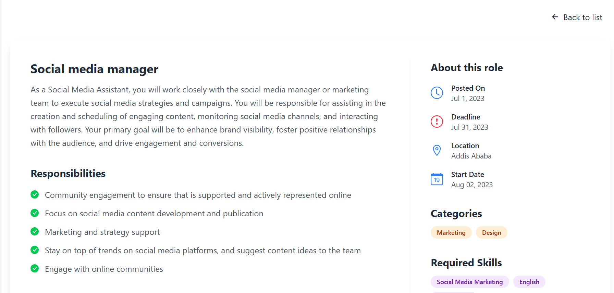
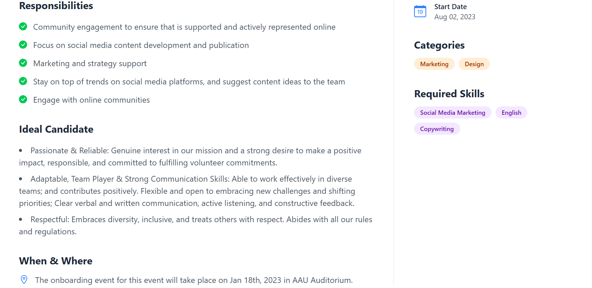

# Job Listening App

A modern Job Listing web application built with **React**, **TypeScript**, **Vite**, and **Tailwind CSS**.

## Features

- Browse job opportunities with detailed cards
- View job details with responsibilities, requirements, and company info
- Responsive, clean UI styled with Tailwind CSS
- Data-driven: jobs loaded from `src/data/jobs.json`

### Job Card Page



### job Dashboard page






## Project Structure

```
job-listening-app/
├── public/
│   └── avatar.jpg           # Default avatar image
├── src/
│   ├── App.tsx              # Main app component
│   ├── App.css              # Tailwind CSS directives
│   ├── main.tsx             # Entry point
│   ├── components/
│   │   ├── JobCard.tsx      # Job card component
│   │   └── JobDashboard.tsx # Job details component
│   └── data/
│       └── jobs.json        # Job data
```

## Getting Started

### 1. Install dependencies

```sh
npm install
```

### 2. Set up Tailwind CSS (if not already present)

```sh
npx tailwindcss init -p
```

Make sure `src/App.css` contains:

```css
@tailwind base;
@tailwind components;
@tailwind utilities;
```

### 3. Start the development server

```sh
npm run dev
```

### 4. Build for production

```sh
npm run build
```

### 5. Preview production build

```sh
npm run preview
```

## Customization

- Add or edit jobs in `src/data/jobs.json`.
- Place a default avatar image as `public/avatar.jpg`.
- Adjust styles in `src/App.css` or use Tailwind utility classes in components.
